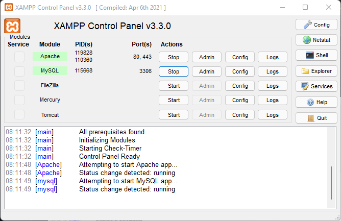
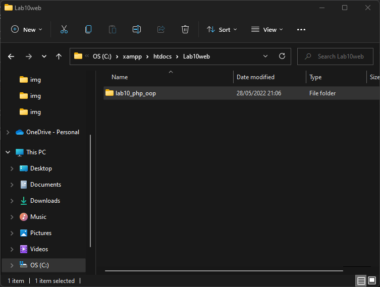

# Praktikum 10

## Profil
| | Biodata |
| -------- | --- |
| **Nama** | Humam Fathurrahman |
| **NIM** | 312010389 |
| **Kelas** | TI.20.A2 |
| **Mata Kuliah** | Pemrograman Web |

## 1. Menjalankan Server

Untuk menjalankan MySQL Server dari menu XAMPP Control seperti berikut.

## 2. Membuat Folder Baru

1. Membuat folder `Lab10web` di direktori htdocs
2. Lalu buat file dengan nama `lab10_php_oop` , kemudian tambahkan seperti berikut.

